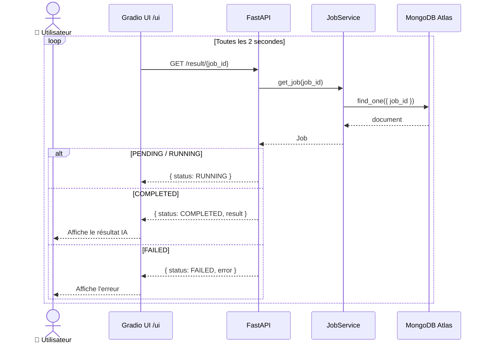

## Poll & Résultat

```mermaid
sequenceDiagram
    actor User as 👤 Utilisateur
    participant UI as Gradio UI /ui
    participant API as FastAPI
    participant JS as JobService
    participant DB as MongoDB Atlas

    loop Toutes les 2 secondes
        UI->>API: GET /result/{job_id}
        API->>JS: get_job(job_id)
        JS->>DB: find_one({ job_id })
        DB-->>JS: document
        JS-->>API: Job

        alt PENDING / RUNNING
            API-->>UI: { status: RUNNING }
        else COMPLETED
            API-->>UI: { status: COMPLETED, result }
            UI-->>User: Affiche le résultat IA
        else FAILED
            API-->>UI: { status: FAILED, error }
            UI-->>User: Affiche l'erreur
        end
    end
```
