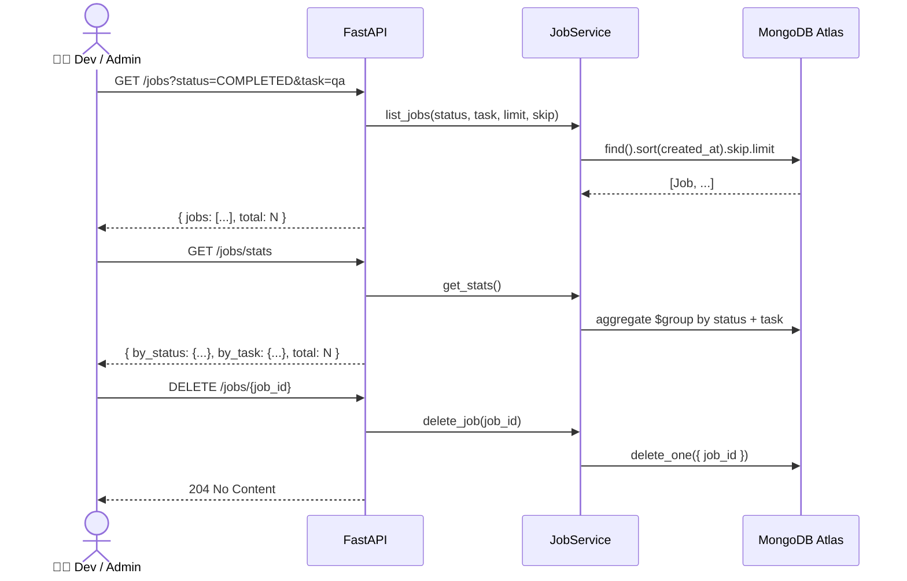

## Routes /jobs

```mermaid
sequenceDiagram
    actor Dev as 👨‍💻 Dev / Admin
    participant API as FastAPI
    participant JS as JobService
    participant DB as MongoDB Atlas

    Dev->>API: GET /jobs?status=COMPLETED&task=qa
    API->>JS: list_jobs(status, task, limit, skip)
    JS->>DB: find().sort(created_at).skip.limit
    DB-->>JS: [Job, ...]
    API-->>Dev: { jobs: [...], total: N }

    Dev->>API: GET /jobs/stats
    API->>JS: get_stats()
    JS->>DB: aggregate $group by status + task
    API-->>Dev: { by_status: {...}, by_task: {...}, total: N }

    Dev->>API: DELETE /jobs/{job_id}
    API->>JS: delete_job(job_id)
    JS->>DB: delete_one({ job_id })
    API-->>Dev: 204 No Content
```
