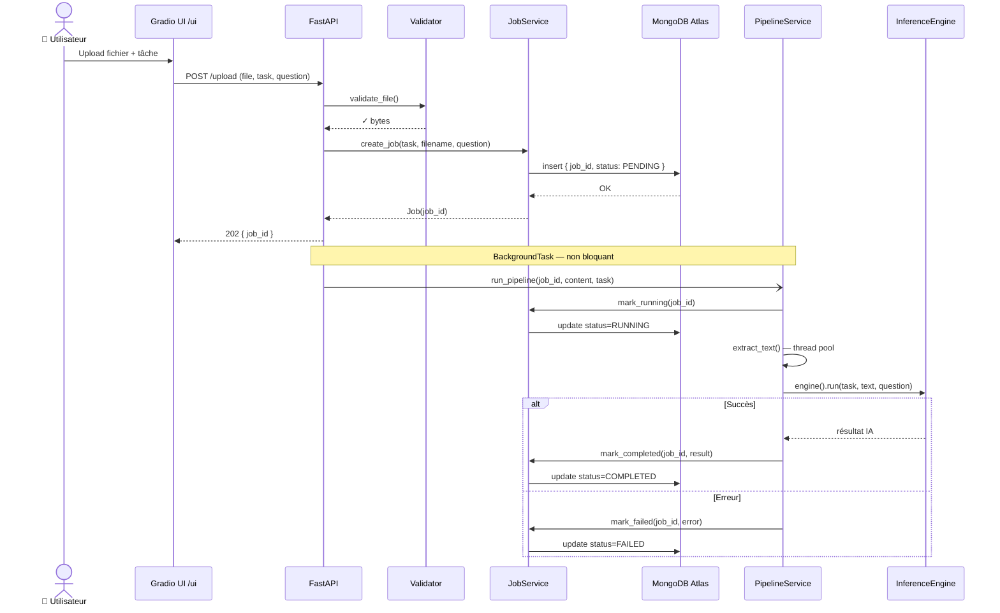

## Upload & Pipeline

```mermaid
sequenceDiagram
    actor User as 👤 Utilisateur
    participant UI as Gradio UI /ui
    participant API as FastAPI
    participant Val as Validator
    participant JS as JobService
    participant DB as MongoDB Atlas
    participant PS as PipelineService
    participant AI as InferenceEngine

    User->>UI: Upload fichier + tâche
    UI->>API: POST /upload (file, task, question)
    API->>Val: validate_file()
    Val-->>API: ✓ bytes
    API->>JS: create_job(task, filename, question)
    JS->>DB: insert { job_id, status: PENDING }
    DB-->>JS: OK
    JS-->>API: Job(job_id)
    API-->>UI: 202 { job_id }

    Note over API,PS: BackgroundTask — non bloquant

    API-)PS: run_pipeline(job_id, content, task)
    PS->>JS: mark_running(job_id)
    JS->>DB: update status=RUNNING
    PS->>PS: extract_text() — thread pool
    PS->>AI: engine().run(task, text, question)

    alt Succès
        AI-->>PS: résultat IA
        PS->>JS: mark_completed(job_id, result)
        JS->>DB: update status=COMPLETED
    else Erreur
        PS->>JS: mark_failed(job_id, error)
        JS->>DB: update status=FAILED
    end
```
